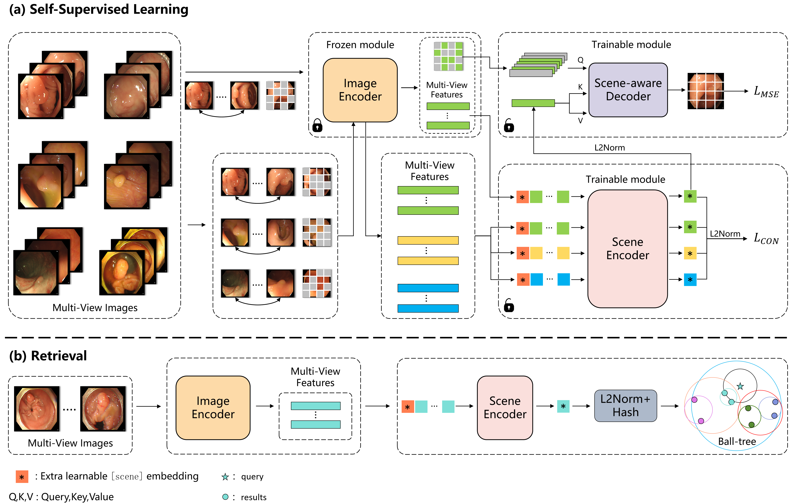

# EndoFinder: Online Lesion Retrieval for Explainable Colorectal Polyp Diagnosis Leveraging Latent Scene Representations

A preliminary version of this work was published at [MICCAI 2024](https://link.springer.com/chapter/10.1007/978-3-031-72117-5_24). Code is available at [EndoFinder-I](https://github.com/ku262/EndoFinder).

This work significantly extends that work by moving from 2D image retrieval to a 2.5D/3D scene retrieval paradigm. We achieve this by explicitly modeling polyps as scenes and leveraging multi-view
perspectives to capture implicit 3D information within a latent
scene representation.

<div align="center">
  
</div>

______

## Setup

- ### Environment

  An example of installation commands is provided as follows:

  ```
  git clone git@github.com:ku262/EndoFinder-Scene.git
  cd EndoFinder-SceneossFlow
  
  pip3 install torch torchvision torchaudio 
  pip3 install -r requirements.txt
  ```

- ### Model Preparation

  We provide trained models from our original experiments to allow
  others to reproduce our evaluation results [EndoFinder-Scene.pth](https://).

- ### Data Preparation

  We introduce and publicly release [PolypScene-250](https://), a novel multi-view polyp dataset, which includes the PolypScene-80 subset with detailed histopathology annotations

______

## Sampling

- ### Train

  ```
  python train.py \
            --batch_size=512 \
            --epochs=200 \
            --output_dir=outputs \
            --finetune=EndoFinder.pth \
  ```

- ### Val
    
  ```
  python demo.py \
            --batch_size=64 \
            --resume=EndoFinder_Scene.pth \
  ```

